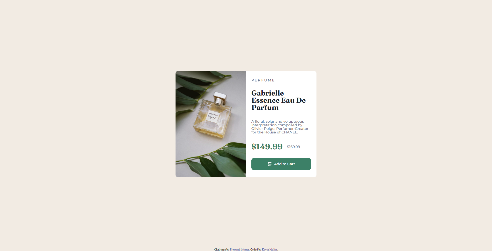
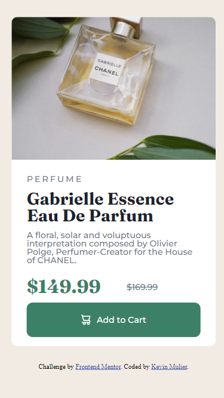

# Frontend Mentor - Product preview card component solution

This is a solution to the [Product preview card component challenge on Frontend Mentor](https://www.frontendmentor.io/challenges/product-preview-card-component-GO7UmttRfa). Frontend Mentor challenges help you improve your coding skills by building realistic projects.

## Table of contents

- [Overview](#overview)
  - [The challenge](#the-challenge)
  - [Screenshot](#screenshot)
  - [Links](#links)
- [My process](#my-process)
  - [Built with](#built-with)
  - [What I learned](#what-i-learned)
  - [Continued development](#continued-development)
- [Author](#author)

## Overview

### The challenge

Users should be able to:

- View the optimal layout depending on their device's screen size
- See hover and focus states for interactive elements

### Screenshot




### Links

- Solution URL: (https://github.com/kevinmulier/kevinmulier.github.io/tree/main/Product%20preview%20card%20component)
- Live Site URL: (https://kevinmulier.github.io/Product%20preview%20card%20component/)

## My process

### Built with

- Semantic HTML5 markup
- CSS custom properties
- Flexbox
- CSS Grid
- Mobile-first workflow

### What I learned

- How to use grid-template-areas and subgrids :

```css
.content {
  display: grid;
  grid-template-columns: repeat(2, 1fr);
  gap: 0px 0px;
  grid-template-areas:
    "image-block image-block"
    "text-block text-block";
}
```

- How to use variables in CSS :

```css
:root {
  --dark-cyan: hsl(158, 36%, 37%);
  --cream: hsl(30, 38%, 92%);
  --very-dark-blue: hsl(212, 21%, 14%);
  --dark-grayish-blue: hsl(228, 12%, 48%);
  --White: hsl(0, 0%, 100%);
}
```

- How to use picture in HTML to provide different source for an image depending on the screen size :

```html
<picture class="image-block">
  <source media="(max-width: 479px)" srcset="images/image-product-mobile.jpg" />
  
</picture>
```

- How to work with a mobile-first approach

### Continued development

- Become more proficient with responsiveness to avoid refactoring my code too many times

- Learn which properties I should use based on position and display to avoid using unnecessary CSS

## Author

- Website - [Kevin Mulier](https://github.com/kevinmulier)
- Frontend Mentor - [@kevinmulier](https://www.frontendmentor.io/profile/kevinmulier)
- Instagram - [@kevin_mulier](https://www.instagram.com/kevin_mulier/)
